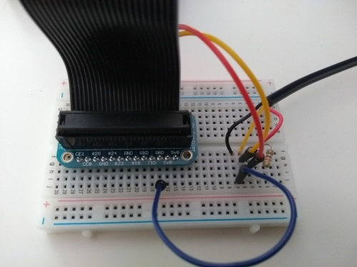

# Aquarium
A home automation project. 

The goal:

*'To take sensor readings from the aquarium using hardware & Raspberry Pi, store
those readings and make them available via an API to a frontend, for example an
Android or iOS app'.*

This project is based on Adafruit's excellent temperature sensor tutorial, over
at https://learn.adafruit.com/adafruits-raspberry-pi-lesson-11-ds18b20-temperature-sensing?view=all. Go check it out; if you get that far, then the rest of this repository should
make a lot more sense ;-)

# Repo Structure

The repository is organised into several major layers or areas of concern. These
are:

- Hardware
- Backend
- Frontend

These are detailed below.

## The Hardware
This contains the low level stuff, circuit information, physical assets, etc.

The schematic for this project is as follows:

This schematic was made with Fritzing http://fritzing.org/home/. I also used
additional parts from the Adafruit fritzing library at https://github.com/adafruit/Fritzing-Library.

#### Raspberry Pi
My Raspberry Pi 3 is based on Raspbian GNU/Linux version 9.

#### The Breadboard
Next to the (half size) breadboard itself, the bill of materials is as follows:

| Part                                          | Notes                        |
|-----------------------------------------------|------------------------------|
| DS18B20 1-Wire Temperature Sensor Probe Cable |                              | 
| Adafruit Pi Cobbler                           | Be careful; I bought an old style 26pin cobbler, but for the Raspberry Pi 3 you should get the newer T-shaped 40 pin breakout! I was still able to use the cobbler I bought, by also purchasing a downgrade ribbon cable. |
| 4.7kΩ Resistor                                |                              |
| 1 pack of jumper wires                        |                              |

For a more detailed list, see [Hardware/schematic_bom.html](Hardware/schematic_bom.html).

A few photos, to give an idea of the implementation below:

## The Backend
The backend consists of Python code to handle taking readings from the temperature
sensor, write it to a database and provide the data to external consumers via a
REST API.

Setup Python on your pi, if it is not already available. The code in this repository
assumes version 2.7, but it should work with other versions too.

To setup the necessary Python libraries, run:
- Install peewee, 'pip install peewee'.
- Install pymysql, 'pip install pymysql'.

The database behind the backend is MariaDB, which is based on MySQL. The schema 
is quite simple:

Concepts:

- One or more aquarium instances.
- Occupants of the aquarium can be defined, with an aquarium reference.
- Sensor readings have a type and measurement unit, along with the reading itself 
and other data and are linked to an aquarium instance.
- A REST endpoint allows consumers to query data.

## The Frontend
Still to do - API consumer, GUI, client.

# Ideas & Todo Items

- TODO: setup python script for peewee, etc.
- TODO: db extension; backend code hardcodes things like aquarium instance, etc.
- TODO: db - add sensor definition; a sensor should be linked to an aquarium instance.
- TODO: create backend API (https://blog.miguelgrinberg.com/post/designing-a-restful-api-with-python-and-flask)
- TODO: create frontend API consumer, GUI, client.
- Build process should be able to create DB, deploy necessary artifacts to the 
Pi.